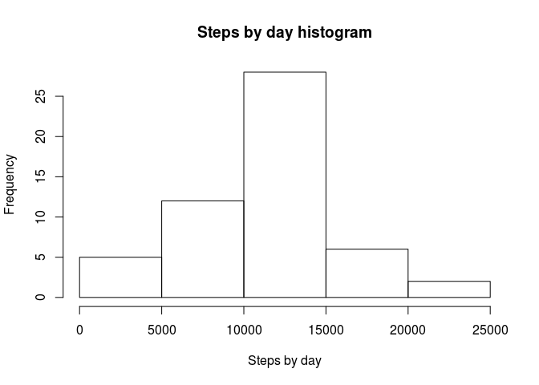
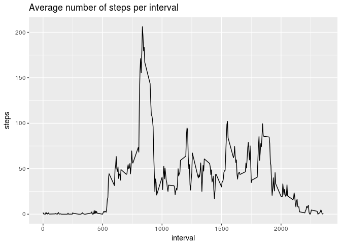
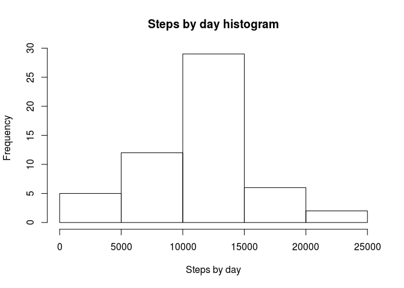
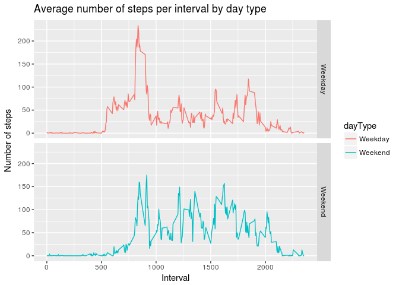

# Reproducible Research: Peer Assessment 1


## Loading and preprocessing the data

```r
# Unzip the data
unzip("activity.zip")
# Read data in activityData
activityData <- read.csv("activity.csv");
```


## What is mean total number of steps taken per day?
1. Make a histogram of the total number of steps taken each day
2. Calculate and report the mean and median total number of steps taken per day

```r
# Sum steps by day
totalStepsByDay <- aggregate(steps ~ date, activityData, sum)
# Create a histogram
hist(totalStepsByDay$steps, main = "Steps by day histogram", xlab = "Steps by day")
```

<!-- -->

```r
# Calculate mean of total steps
mean(totalStepsByDay$steps)
```

```
## [1] 10766.19
```

```r
# Calculate median of total steps
median(totalStepsByDay$steps)
```

```
## [1] 10765
```

## What is the average daily activity pattern?

```r
# Average steps by interval
stepsAvgByInterval <- aggregate(steps ~ interval, activityData, mean)
# Plot the data
ggplot(data = stepsAvgByInterval, aes(x=interval, y=steps))+geom_line()+
        ggtitle("Average number of steps per interval")
```

<!-- -->

```r
# Find the row that has the most number of steps
maxNumberOfStepsRow <- which.max(stepsAvgByInterval$steps)
```

```
## [1] "The interval that contains maximum number of steps is 835"
```


## Imputing missing values

```r
totalNumberOfMissingData <- sum(is.na(activityData$steps))
```


```
## [1] "There are 2304 missing values"
```


```r
# Create a new dataset from activityData
activityDataFilled <- activityData
# Find missing steps in activityData
missingSteps <- which(is.na(activityDataFilled))
# Fill missing data in activityDataFilled with mean on that interval
activityDataFilled[missingSteps,]$steps <- stepsAvgByInterval$steps[which(stepsAvgByInterval$interval==activityDataFilled[missingSteps,]$interval)]

# Recreate the first histogram using activityDataFilled
# Sum steps by day
totalStepsByDay <- aggregate(steps ~ date, activityDataFilled, sum)
# Create a histogram
hist(totalStepsByDay$steps, main = "Steps by day histogram", xlab = "Steps by day")
```

<!-- -->

```r
# Calculate mean of total steps
mean(totalStepsByDay$steps)
```

```
## [1] 10766.19
```

```r
# Calculate median of total steps
median(totalStepsByDay$steps)
```

```
## [1] 10765.59
```
We note that the **mean** value has **not changed** and the **median** value **changed by 0.59**

## Are there differences in activity patterns between weekdays and weekends?

```r
# Add day type
activityDataFilled$dayType <- ifelse(weekdays(as.Date(activityDataFilled$date)) %in% c("Saturday","Sunday"),"Weekend","Weekday")
# Mean the number of steps
stepsAvgByInterval <- aggregate(steps ~ interval+dayType, activityDataFilled, mean)
plt <- ggplot(data = stepsAvgByInterval, aes(x=interval, y=steps))+ 
        geom_line(aes(colour = dayType))+
        facet_grid(dayType ~ .)+
        xlab("Interval")+
        ylab("Number of steps")+
        ggtitle("Average number of steps per interval by day type")
print(plt)
```

<!-- -->

As the above plot shows, the average number of steps are different in Weekdays and Weekends.
